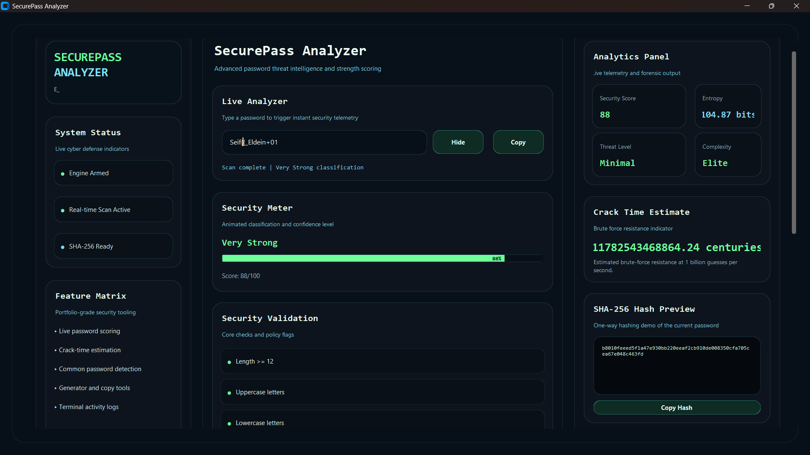
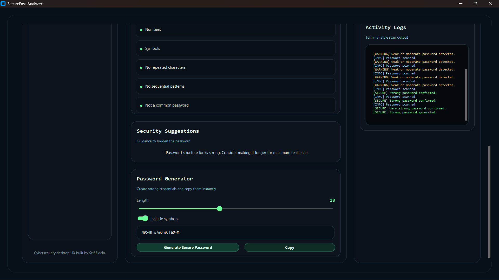

# SecurePass Analyzer

SecurePass Analyzer is a futuristic Python desktop application for password strength analysis, security scoring, hashing, and password generation. It is designed as a cybersecurity tool with a premium cyberpunk dashboard style.

## Features

- Real-time password strength checking
- Weak, Medium, Strong, and Very Strong classification
- Length, character class, repetition, and sequence validation
- Animated strength meter with color feedback
- Security suggestions and threat scoring
- Crack time estimation from seconds to centuries
- Common password detection
- Strong password generator with copy support
- SHA-256 hashing demo
- Terminal-style security activity logs
- Matrix-inspired animated background
- Modern neon cyber UI with responsive desktop layout

## Screenshots





## Installation

1. Create and activate a virtual environment.
2. Install dependencies:

```bash
pip install -r requirements.txt
```

## Usage

Run the application with:

```bash
python main.py
```

Type a password into the analyzer to see live scoring, crack-time estimates, suggestions, and logs.

## Technologies Used

- Python 3
- CustomTkinter
- tkinter
- hashlib
- re
- math
- random
- string
- Pillow

## Folder Structure

```text
project/
├── main.py
├── ui/
│   ├── dashboard.py
│   ├── components.py
├── core/
│   ├── checker.py
│   ├── entropy.py
│   ├── generator.py
│   ├── hashing.py
├── assets/
│   ├── icons/
│   ├── images/
├── utils/
│   ├── helpers.py
├── requirements.txt
├── README.md
```

## Future Improvements

- Export analysis reports to PDF or CSV
- Add password policy templates for enterprise environments
- Add breach-checking integration with offline datasets
- Add theme switching and custom accent colors
- Add account security audit workflows

## Author

Built by Seif Eldein for the DecodeLabs Cyber Security intern.
